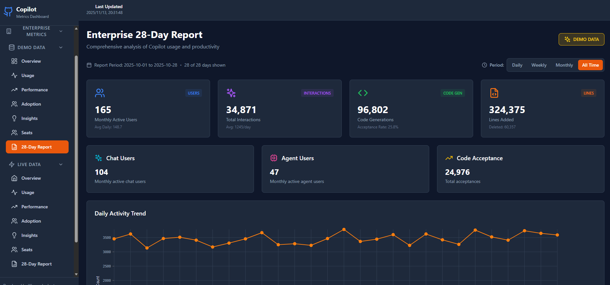
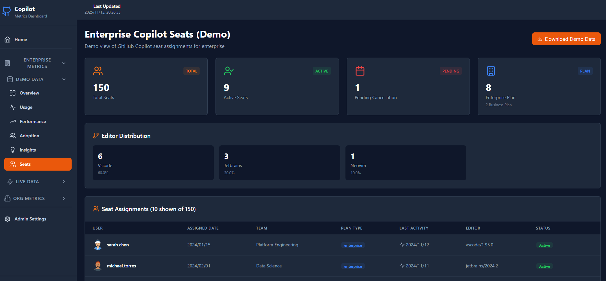

# GitHub Copilot Metrics Dashboard

A modern, responsive React application for visualizing GitHub Copilot metrics and analytics. Built with React, TypeScript, Vite, and Nivo charts.

  

## � Screenshots

### Enterprise 28-Day Report
Comprehensive 28-day metrics visualization with daily activity trends, feature usage breakdown, language statistics, and lines of code analysis.



### Copilot Seats Management
View and manage GitHub Copilot seat assignments with detailed information about active users, teams, plan types, and editor distribution.



## �🚀 Live Demo

**Try it out:** [View Demo Dashboard](https://app-ghcp-simple-metrics-dashboard-demo.azurewebsites.net/)

Explore the full dashboard with sample data - no GitHub token required! The demo includes:
- **Enterprise Metrics Demo** - Overview, Usage, Performance, Adoption, and Seats pages with realistic sample data
- **Organization Metrics Demo** - Complete set of demo visualizations
- **Admin Demo Mode** - View the configuration interface (inputs disabled in demo)

> **Note:** The demo site uses sample data. To view your organization's real metrics, follow the setup instructions below.

## Features

✨ **Modern UI** - Clean, dark-themed interface with smooth transitions
📊 **Rich Visualizations** - Interactive charts using Nivo (Line, Bar, Pie charts)
📱 **Responsive Design** - Works seamlessly on desktop, tablet, and mobile
🎯 **Multiple Dashboards** - Organized by metric categories:
  - **Enterprise Metrics** (Demo & Live Data):
    - Overview - Key metrics and high-level insights
    - Usage - Detailed usage patterns and trends
    - Performance - Chat performance and productivity metrics
    - Adoption - User engagement and adoption analytics
    - Seats - Copilot seat assignments and management
    - 28-Day Report - Comprehensive 28-day metrics visualization
  - **Organization Metrics** (Demo & Live Data):
    - Overview - Organization-wide insights
    - Usage Metrics - Detailed usage patterns
    - Performance - Acceptance rates and productivity
    - Adoption - User engagement analytics
🎭 **Demo Mode** - Explore all features with realistic sample data before connecting your GitHub organization
🔒 **Secure Deployment** - Environment variables and tokens never committed or deployed

## Tech Stack

- **React 18** - Modern React with hooks
- **TypeScript** - Type-safe development
- **Vite** - Fast build tool and dev server
- **Nivo** - Beautiful, responsive charts
- **Tailwind CSS** - Utility-first styling
- **React Router** - Client-side routing
- **Lucide React** - Modern icon library

## Getting Started

### Prerequisites

- Node.js 16+ and npm

### Installation

1. Clone the repository:
```bash
git clone https://github.com/warrenandre/GitHub_Copilot_Simple_Metrics_Dashboard.git
cd GHCPDashboardApp
```

2. Install dependencies for all parts:
```bash
npm run install:all
```

Or install separately:
```bash
# Root dependencies (for running both servers)
npm install

# Frontend dependencies
cd frontend && npm install

# Backend dependencies
cd ../backend && npm install
```

3. Start both frontend and backend servers:
```bash
npm run dev
```

The frontend will be available at `http://localhost:5173` and the backend API at `http://localhost:3000`

### API Configuration

The app supports multiple ways to configure the GitHub Copilot Metrics API:

**Option 1: Admin UI (Recommended)**
1. Navigate to `/admin` in the app
2. Enter your GitHub organization name and personal access token
3. Configure date ranges and team settings
4. Download metrics data

**Option 2: Local Config File**
```bash
# Copy the example config
cp src/config/apiConfig.local.example.ts src/config/apiConfig.local.ts

# Edit with your credentials (this file is git-ignored)
# Update apiConfig.ts to import your local config
```

**Option 3: Environment Variables**
```bash
# Create .env.local file
echo "VITE_GITHUB_ORG=your-org" >> .env.local
echo "VITE_GITHUB_TOKEN=ghp_your_token" >> .env.local

# Update src/config/apiConfig.ts to read from env
```

📖 For detailed configuration instructions, see [docs/API_CONFIGURATION.md](docs/API_CONFIGURATION.md)

### Development

Start both frontend and backend servers:
```bash
npm run dev
```

Or start them separately:
```bash
# Frontend only (from root)
npm run dev:frontend

# Backend only (from root)
npm run dev:backend
```

The frontend will be available at `http://localhost:5173` and the backend API at `http://localhost:3000`

### Build

Build the frontend for production:
```bash
npm run build
```

This creates optimized files in `frontend/dist/`

### Production

Start the production server (serves both API and built frontend):
```bash
npm start
```

The entire app will be available at `http://localhost:3000`

## Deployment

### Deploy to Azure with Azure Developer CLI (Recommended)

The easiest way to deploy this application to Azure:

1. **Prerequisites**:
   - Install [Azure Developer CLI (azd)](https://learn.microsoft.com/azure/developer/azure-developer-cli/install-azd)
   - Azure subscription

2. **Deploy**:
   ```bash
   # Login to Azure
   azd auth login
   
   # Deploy everything (creates resources + deploys app)
   azd up
   ```

3. **Configuration**:
   - The deployed app uses sample data from `.env.example`
   - Your local `.env` file with real credentials is **never** deployed (excluded via `.azdignore`)
   - To use real data in production, configure environment variables in Azure Portal:
     - Go to your App Service → Configuration → Application settings
     - Add: `VITE_GITHUB_ORG`, `VITE_GITHUB_TOKEN`, etc.

4. **Update Deployment**:
   ```bash
   # Redeploy after code changes
   azd deploy
   ```

**What `azd up` creates**:
- Resource Group
- App Service Plan (Free/Basic tier)
- App Service (Static Web App)
- Automatically builds and deploys your app

### Manual Deployment

Alternatively, deploy the built files from `dist/` folder to any static hosting service:
- Azure Static Web Apps
- Netlify
- Vercel
- GitHub Pages
- AWS S3 + CloudFront

Build the app first:
```bash
npm run build
```

Then upload the `dist/` folder contents to your hosting provider.

## Project Structure

```
GHCPDashboardApp/
├── frontend/               # React frontend application
│   ├── src/
│   │   ├── components/    # Reusable UI components
│   │   │   ├── Layout.tsx # Main layout with sidebar
│   │   │   ├── MetricCard.tsx  # Metric display cards
│   │   │   ├── LineChart.tsx   # Line chart component
│   │   │   ├── BarChart.tsx    # Bar chart component
│   │   │   ├── PieChart.tsx    # Pie chart component
│   │   │   └── ThemeToggle.tsx # Dark/light theme toggle
│   │   ├── config/        # Configuration files
│   │   │   ├── apiConfig.ts    # API configuration with validation
│   │   │   └── apiConfig.local.example.ts  # Example local config
│   │   ├── contexts/      # React contexts
│   │   │   └── ThemeContext.tsx # Theme management
│   │   ├── pages/         # Page components
│   │   │   ├── Home.tsx   # Landing page
│   │   │   ├── Admin.tsx  # API configuration page
│   │   │   ├── enterprise/ # Enterprise-level pages
│   │   │   │   ├── demo/  # Demo data pages
│   │   │   │   └── live/  # Live data pages
│   │   │   └── org/       # Organization-level pages
│   │   │       ├── demo/  # Demo data pages
│   │   │       └── live/  # Live data pages
│   │   ├── services/      # API and services
│   │   │   ├── api.ts     # Mock data service
│   │   │   ├── githubApi.ts # GitHub API integration
│   │   │   └── dataTransform.ts # Data transformation
│   │   ├── types/         # TypeScript type definitions
│   │   │   └── metrics.ts # Metrics data types
│   │   ├── App.tsx        # Main app component
│   │   ├── main.tsx       # Application entry point
│   │   └── index.css      # Global styles
│   ├── public/            # Static assets
│   ├── index.html         # HTML template
│   ├── vite.config.ts     # Vite configuration
│   ├── tsconfig.json      # TypeScript configuration
│   ├── tailwind.config.js # Tailwind CSS configuration
│   └── package.json       # Frontend dependencies
├── backend/               # Express.js backend API
│   ├── server.js          # API server and proxy
│   └── package.json       # Backend dependencies
├── docs/                  # Documentation
│   ├── API_CONFIGURATION.md
│   ├── BACKEND_PROXY.md
│   ├── METRICS_INSIGHTS.md
│   └── DATA_STORAGE.md
├── Deployment/            # Deployment configurations
├── infra/                 # Infrastructure as code
├── package.json           # Root scripts and concurrently
└── README.md              # This file
```

## GitHub Copilot API Integration

The app integrates with the GitHub Copilot Metrics API to display real-time metrics for your organization.

### Features

- **Demo Data Mode** - Explore the dashboard with mock data
- **Live Data Mode** - Connect to real GitHub API for your org metrics
- **Admin Console** - Easy configuration interface with validation
- **Secure Storage** - API config stored securely (tokens never committed)
- **Auto-Refresh** - Live pages refresh automatically every 5 minutes
- **Dual Storage** - Data saved to both localStorage and local files for persistence

### Setting Up

1. **Get a Personal Access Token**:
   - Go to GitHub Settings → Developer settings → Personal access tokens
   - Create a token with `manage_billing:copilot`, `read:org`, or `read:enterprise` scope
   - You must be an organization owner

2. **Configure in the App**:
   - Navigate to `/admin`
   - Enter your org name and token
   - Set optional date range and team slug
   - Click "Download & Save Locally"

3. **Save Data File** (Optional for persistence):
   - A JSON file will be downloaded to your Downloads folder
   - Move it to `public/data/` folder in the project
   - Rename to `copilot-metrics.json`
   - The app will automatically load from this file if localStorage is empty

4. **View Live Metrics**:
   - Navigate to Live Data pages
   - Data automatically loads from localStorage or local file
   - Refresh anytime or wait for auto-refresh

### Data Storage

The app uses a dual-storage approach:

1. **localStorage** (Primary) - Fast, immediate access for current browser session
2. **Local File** (Backup) - `/public/data/copilot-metrics.json` for persistence across sessions

When you download data from Admin page:
- Data is saved to localStorage automatically
- A JSON file is downloaded to your Downloads folder
- Manually move this file to `public/data/copilot-metrics.json` for automatic loading

The live pages will:
1. Check localStorage first (fastest)
2. Fall back to loading from `/public/data/copilot-metrics.json` if localStorage is empty
3. Save file data to localStorage for faster subsequent access

### Requirements

- Organization with 5+ active Copilot licenses
- Organization owner permissions
- Personal access token with correct scopes
- Copilot Metrics API access enabled

For detailed documentation: [docs/API_CONFIGURATION.md](docs/API_CONFIGURATION.md)

API Documentation: [GitHub Copilot Metrics API](https://docs.github.com/en/rest/copilot/copilot-metrics)

### Debugging API Issues

If you encounter issues calling the GitHub Copilot API:

📖 **Quick Start**: See [DEBUGGING_QUICK_START.md](DEBUGGING_QUICK_START.md) for common errors and quick fixes

📖 **Full Guide**: See [docs/DEBUGGING_API.md](docs/DEBUGGING_API.md) for comprehensive debugging steps

**Quick Debug Checklist:**
1. Open Browser DevTools (F12) → Console tab
2. Look for detailed debug logs (🔍 📤 📥 ✅ or ❌ emojis)
3. Check Network tab for API request/response
4. Verify token has correct scopes
5. Test with curl to isolate issues

## Customization

### Themes

Edit `tailwind.config.js` to customize colors:
```js
theme: {
  extend: {
    colors: {
      primary: { /* your colors */ }
    }
  }
}
```

### Charts

Chart configurations are in individual component files (`src/components/*Chart.tsx`). Modify Nivo chart props to customize appearance and behavior.

## Contributing

Contributions are welcome! Please feel free to submit a Pull Request.

## License

MIT License - feel free to use this project for your own purposes.

## ⚠️ Usage Terms

**You are free to use, modify, and distribute this repository** under the MIT License, with the following requirement:

**The application footer containing developer attribution ("Developed by Warren Joubert - Microsoft Software Engineer") must remain intact and unmodified.**

This footer is protected by multiple validation systems:
- Cryptographic validation on application startup
- Real-time DOM monitoring and integrity checks
- Automatic application reload if footer is removed or modified
- CSS-based protection against tampering

**What you can do:**
- ✅ Use this code for personal or commercial projects
- ✅ Modify any functionality, styling, or features
- ✅ Deploy to your own infrastructure
- ✅ Fork and create derivative works

**What you cannot do:**
- ❌ Remove or modify the footer attribution
- ❌ Disable the footer protection mechanisms
- ❌ Claim authorship of the original work

The footer serves as attribution for the original development work while allowing full usage of the codebase. If you have specific requirements that conflict with this, please open an issue to discuss.

## Acknowledgments

- GitHub Copilot for powering AI-assisted development
- Nivo for excellent chart components
- The React and Vite communities
